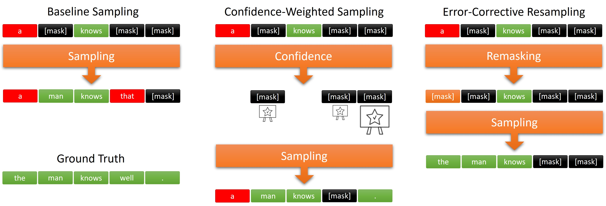

# Improving Masked Diffusion via Confidence-Weighted Sampling and Error-Corrective Resampling

<p align="center">
  
  <em>Baseline vs confidence-weighted vs error-corrective sampling</em>
  <br><br>
</p>

## 🔍 Overview  
This project compares **baseline vs confidence-weighted vs error-corrective sampling** for MDLM inference, highlighting how confidence-aware sampling and corrective resampling reduce errors and improve fluency.

## 🎯 Objective  
The goal is to improve MDLM text generation by moving from **baseline sampling** to **confidence-weighted sampling** (prioritizing high-confidence tokens) and **error-corrective sampling** (time-dependent remasking).

##  🤗 Checkpoint

An MDLM model trained on OpenWebText for 1M training steps is available on the Hugging Face Hub 🤗:
[kuleshov-group/mdlm-owt](https://huggingface.co/kuleshov-group/mdlm-owt)


## 📄 Full Report
A full report with detailed explanations and analysis is included in this repository.
You can find it here: [`report/report.pdf`](./report/report.pdf).


## 🛠️ Preparation

#### 1. Create Conda Environment
```bash
conda create -n mdlm python=3.9
conda activate mdlm
```

#### 2. Install PyTorch 2.2
```bash
pip install torch==2.2.1 torchvision==0.17.1   torchaudio==2.2.1 --index-url https://download.pytorch.org/whl/cu121
```
#### 3. Install Dependencies
```bash
pip install -r requirements.txt
```

## 🧪 Reproducing Experiments
below, we describe the steps required for reproducing the experiments.
Throughout, the main entry point for running experiments is the [`main.py`](./main.py) script.

### Generate Samples
<a name="sample-gen"></a>
The argument to `sampling.predictor` specifies the sampler which takes one of the following values:
* `ddpm`: Baseline ancestral DDPM/D3PM sampling.
* `confidence`: Confidence-Weighted Sampling.
* `adaptive`: Error-Corrective Resampling.
* `merge`: Hybrid of confidence + adaptive.

We generate 200 sequences of length 2048 tokens on a single `3090` GPU and evaluate generative perplexity under a pre-trained GPT-2 model. In the following table we report main results on generation quality and diversity.

|                     | Gen. PPL ($\downarrow$) | Self BLEU-4 ($\downarrow$) | Distinct-2 ($\uparrow$) | Distinct-3 ($\uparrow$) |
|---------------------|-------------------------:|----------------------------:|------------------------:|------------------------:|
| **MDLM** + `ddpm_cache` | 25.7 | 0.056 | 0.79 | 0.97 |
| **MDLM** + `confidence` | 22.6 | 0.064 | 0.79 | 0.97 |
| **MDLM** + `adaptive` | 23.1 | **0.047** | 0.80 | 0.97 |
| **MDLM** + `merge` | **20.2** | 0.055 | **0.81** | **0.98** |


To generate samples from a pre-trained model use the following command:
#### Huggingface model
```bash
python main.py \
  mode=sample_eval \
  eval.checkpoint_path=kuleshov-group/mdlm-owt \
  data=openwebtext-split  \
  model.length=1024  \
  sampling.predictor=merge  \
  sampling.steps=1000 \
  loader.eval_batch_size=1 \
  sampling.num_sample_batches=10 \
  backbone=hf_dit
```